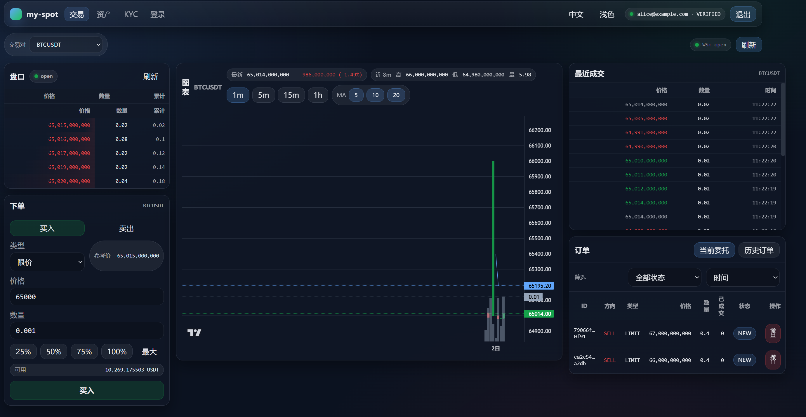

# my-spot

[English](#english) | [中文](#中文)

## 中文

my-spot 是一个可运行的“现货交易”示例项目（Spot Exchange Demo），目标是把**账户体系 + 资产流水 + 充值/提现模拟 + 交易撮合 + 行情推送 + 前端页面**打通成一个完整闭环，便于学习与二次开发。



### 特性

- 账户与安全
  - 注册 / 两步登录（密码 + OTP）/ 重置密码
  - 设备绑定与安全日志
  - 基础 KYC（示例）
  - 资金密码（用于提现）
- 资产与流水
  - 钱包（可用/冻结）
  - 账本流水（Ledger）
  - 充值地址生成（示例）
  - 充值入账模拟：PENDING → 定时确认入账
  - 提现流程模拟：冻结 → PROCESSING → DONE（定时推进）
- 现货交易
  - 交易对、订单簿 Top5、最近成交、简化 K 线（1m）
  - 限价/市价下单
  - 撮合：价格优先、时间优先（简化实现）
  - 撤单与余额释放
- 实时行情
  - WebSocket 推送（成交/盘口刷新提示）
- 前端
  - Vue3 + Vite + TypeScript
  - 简易交易页/资产页/KYC/登录页
  - atomic（整数）金额展示为小数（默认 8 位）
- 自动化脚本
  - Windows 与 Linux 分目录脚本：启动/重置 DB/接口冒烟测试/100 用户模拟交易

### 技术栈

- 后端：Java 17，Spring Boot（Web / Security / Data JPA / Validation / WebSocket / Actuator），H2
- 前端：Vue 3，Vite，TypeScript，Pinia，Vue Router，Axios
- 代码格式：Spotless（Maven）统一 Java 缩进（4 空格）

### 目录结构

```
my-spot/
  backend/          # Spring Boot 后端
  web/              # Vue3 前端
  scripts/
    windows/        # PowerShell 脚本
    linux/          # Bash 脚本
  docs/             # 文档（接口/数据/脚本）
```

### 快速开始

前置依赖
- Java 17
- Maven 3.8+
- Node.js 18+（推荐 20+）
- npm

#### Windows

```powershell
.\scripts\windows\start-all.ps1
```

#### Linux

```bash
chmod +x scripts/linux/*.sh
./scripts/linux/start-all.sh
```

启动后
- 后端：`http://localhost:3001`
- 前端：`http://localhost:5173`

### 测试账号与数据说明

种子数据会在后端启动时自动初始化（幂等）。

- alice@example.com / Passw0rd!（已 KYC，资金密码 123456）
- bob@example.com / Passw0rd!（已 KYC，资金密码 123456）

详情见：
- [docs/data.md](./docs/data.md)
- [docs/api.md](./docs/api.md)
- [docs/scripts.md](./docs/scripts.md)

### 接口冒烟测试

Windows：
```powershell
.\scripts\windows\api-smoke-test.ps1
```

Linux：
```bash
./scripts/linux/api-smoke-test.sh
```

环境变量
- `SPOT_BASE_URL`（默认 `http://localhost:3001`）
- `SPOT_DEV_ADMIN_KEY`（默认 `dev-admin-key`）

### 100 在线用户模拟交易（Mock）

Windows：
```powershell
.\scripts\windows\mock-100-users.ps1 -UserCount 100 -Rounds 200
```

Linux：
```bash
./scripts/linux/mock-100-users.sh 100 200
```

说明：该脚本会批量注册/登录/完成 KYC/模拟充值，并持续下单撮合以产生交易流。

### 设计说明（简述）

- 金额统一使用 atomic（整数）表示，避免浮点误差（默认 8 位小数）
- 买单会冻结 quote 资产（含预估手续费）；卖单会冻结 base 资产数量
- 交易成交后更新双方钱包与账本流水（简化示例）

### 后续计划（Roadmap）

该项目定位为“可运行的学习型现货交易 Demo”，后续会逐步向更接近真实交易系统的工程形态演进：

1. **事件驱动架构（Event-Driven）**
   - 将“下单/撤单/撮合/清算/行情”解耦为事件流水线
   - 引入事件溯源/回放能力（Replay）
2. **高性能撮合与流水线**
   - 引入 LMAX Disruptor 作为撮合核心的 in-memory 事件环形队列
   - 评估 Aeron 作为低延迟消息传输（进程间/集群间）
3. **状态与持久化重构**
   - 引入更严格的订单状态机与幂等一致性策略
   - 从简单 JPA/H2 过渡到可扩展的存储（例如 PostgreSQL / RocksDB / 事件存储）
4. **风险与风控**
   - 更细粒度的资金校验、额度、限频、黑白名单
   - 更完整的 KYC/AML 接口对接（示例化）
5. **撮合深度与行情**
   - 更完善的盘口聚合、增量推送、快照/增量一致性
   - 支持更多周期 K 线与历史行情存储
6. **可观测性与工程化**
   - Metrics/Tracing/Logging 规范化
   - 压测与容量评估脚本（更强并发、多场景）

### 免责声明

本项目仅用于学习、演示与开源交流，不构成任何投资建议，也不建议直接用于生产环境。

---

## English

my-spot is a runnable Spot Exchange demo that aims to provide an end-to-end learning playground: **accounts + wallets/ledger + deposit/withdraw simulation + order matching + market data + WebSocket + a simple web UI**.


### Features

- Account & Security
  - Register / 2-step login (password + OTP) / password reset
  - Device binding and operation logs
  - Basic KYC (demo)
  - Fund password for withdrawals
- Wallet & Ledger
  - Wallet balances (available/frozen)
  - Ledger entries
  - Deposit address (demo)
  - Simulated deposits: PENDING → auto confirm
  - Simulated withdrawals: freeze → PROCESSING → DONE
- Spot Trading
  - Pairs, Top5 order book, recent trades, simplified 1m kline
  - Limit / market orders
  - Price-time priority matching (simplified)
  - Cancel orders and release funds
- Real-time Market Data
  - WebSocket notifications (trade + book hint)
- Web UI
  - Vue 3 + Vite + TypeScript
  - Simple pages: Trade / Wallet / KYC / Login
  - Convert atomic integers to decimal display (default 8 decimals)
- Scripts
  - Windows & Linux scripts for start/reset/smoke tests/mock users

### Tech Stack

- Backend: Java 17, Spring Boot (Web/Security/JPA/Validation/WebSocket/Actuator), H2
- Frontend: Vue 3, Vite, TypeScript, Pinia, Vue Router, Axios
- Formatting: Spotless (Maven), 4-space indentation

### Project Layout

```
my-spot/
  backend/
  web/
  scripts/
    windows/
    linux/
  docs/
```

### Quick Start

Prerequisites
- Java 17
- Maven 3.8+
- Node.js 18+ (20+ recommended)
- npm

Windows:
```powershell
.\scripts\windows\start-all.ps1
```

Linux:
```bash
chmod +x scripts/linux/*.sh
./scripts/linux/start-all.sh
```

URLs
- Backend: `http://localhost:3001`
- Web: `http://localhost:5173`

### Docs

- [docs/api.md](./docs/api.md)
- [docs/data.md](./docs/data.md)
- [docs/scripts.md](./docs/scripts.md)

### Smoke Tests

Windows:
```powershell
.\scripts\windows\api-smoke-test.ps1
```

Linux:
```bash
./scripts/linux/api-smoke-test.sh
```

Env
- `SPOT_BASE_URL` (default `http://localhost:3001`)
- `SPOT_DEV_ADMIN_KEY` (default `dev-admin-key`)

### Mock 100 Online Users

Windows:
```powershell
.\scripts\windows\mock-100-users.ps1 -UserCount 100 -Rounds 200
```

Linux:
```bash
./scripts/linux/mock-100-users.sh 100 200
```

### Roadmap

This project is a runnable demo today, and will evolve toward a more production-like architecture:

1. **Event-driven architecture**
   - Decouple order placement/cancel/matching/settlement/market-data into an event pipeline
   - Add replay capability (event sourcing style)
2. **High-performance matching pipeline**
   - Use LMAX Disruptor for in-memory event processing
   - Evaluate Aeron for low-latency messaging (IPC / cluster transport)
3. **State & persistence redesign**
   - Stronger state machine + idempotency guarantees
   - Move beyond JPA/H2 for scalable storage (e.g. PostgreSQL / RocksDB / event store)
4. **Risk controls**
   - Limits, throttling, allow/deny lists
   - More complete KYC/AML integration (demo-friendly)
5. **Market data & depth**
   - Better order book aggregation, snapshot/incremental consistency
   - More kline intervals and historical storage
6. **Observability & engineering**
   - Metrics/tracing/logging best practices
   - Stronger load tests (more concurrency and scenarios)

### Disclaimer

This project is for educational and open-source sharing only. Do not use it as-is in production.

